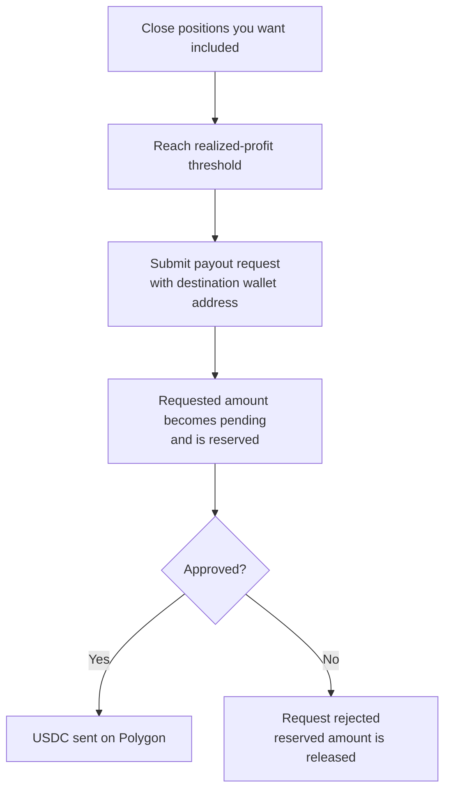

Use this page as the main source for funded payouts. It explains when you are eligible, how much you can request, and how the wallet payout flow works.

## You can request a payout when

All of these must be true:

1. Your **realized profit** after prior paid payouts has reached the threshold (30% of your starting balance).
2. You have **no other payout request pending** for that funded account.
3. You provide a valid **EVM wallet address** that can receive USDC on Polygon.

<Note>
  Only realized profit counts. Open positions do not count until you close them.
</Note>

## Current payout rules

- **Profit split:** 90% to you, 10% to PolyFundr
- **Threshold:** 30% of starting balance in realized profit
- **Current max request:** \$1,000 gross per request
- **Payout currency:** USDC on Polygon
- **Destination:** required on every request and not saved as a default
- **One pending request at a time:** while pending, the requested gross amount is reserved against further payout availability
- **Processing time:** usually within 24 hours

## Simple example

On a \$50,000 funded account, the threshold is \$15,000 in realized profit. Once you are eligible, the current maximum request is \$1,000 gross. At a 90% split, that pays \$900 to you.

## Payout lifecycle

## How to request one

<Steps>
  <Step title="Close any positions you want included">
    Payout calculations use realized profit only. Close the positions you want to count before submitting a request.
  </Step>
  <Step title="Go to the Payouts page">
    In the app, navigate to **Payouts** from the main menu.
  </Step>
  <Step title="Enter your destination wallet address">
    Provide the wallet address you want the USDC sent to. This address is not saved. You must enter it with every request.
  </Step>
  <Step title="Submit the request">
    Review the payout amount and confirm. Once submitted, the requested amount is reserved against your available balance while the payout is pending.
  </Step>
  <Step title="Receive your funds">
    PolyFundr processes the request within 24 hours on average. On approval, USDC is transferred on-chain to the destination address you provided.
  </Step>
</Steps>

## Destination wallet requirements

Funds are sent as USDC to the wallet address you provide at the time of the request. Enter the full address carefully. The destination is not saved between requests, and transfers cannot be reversed once sent.

## What happens after you submit

When you submit a request, the requested amount is **reserved** against your available balance immediately. This means:

- You cannot request the same gross amount again while that payout is pending.
- Your available payout balance is reduced until the request is approved or rejected.

<Warning>
  Always provide the correct destination wallet address. Payout destinations are not saved, and on-chain USDC transfers cannot be recalled once sent.
</Warning>

## How the threshold works after a payout

The threshold stays tied to your funded account's starting balance. After a payout is sent, prior paid payouts are deducted from the realized-profit calculation. You need to build realized profit back above the threshold before the next request becomes available.

<Info>
  Need the funded account overview? Read [Funded overview](/funded/overview).
</Info>
